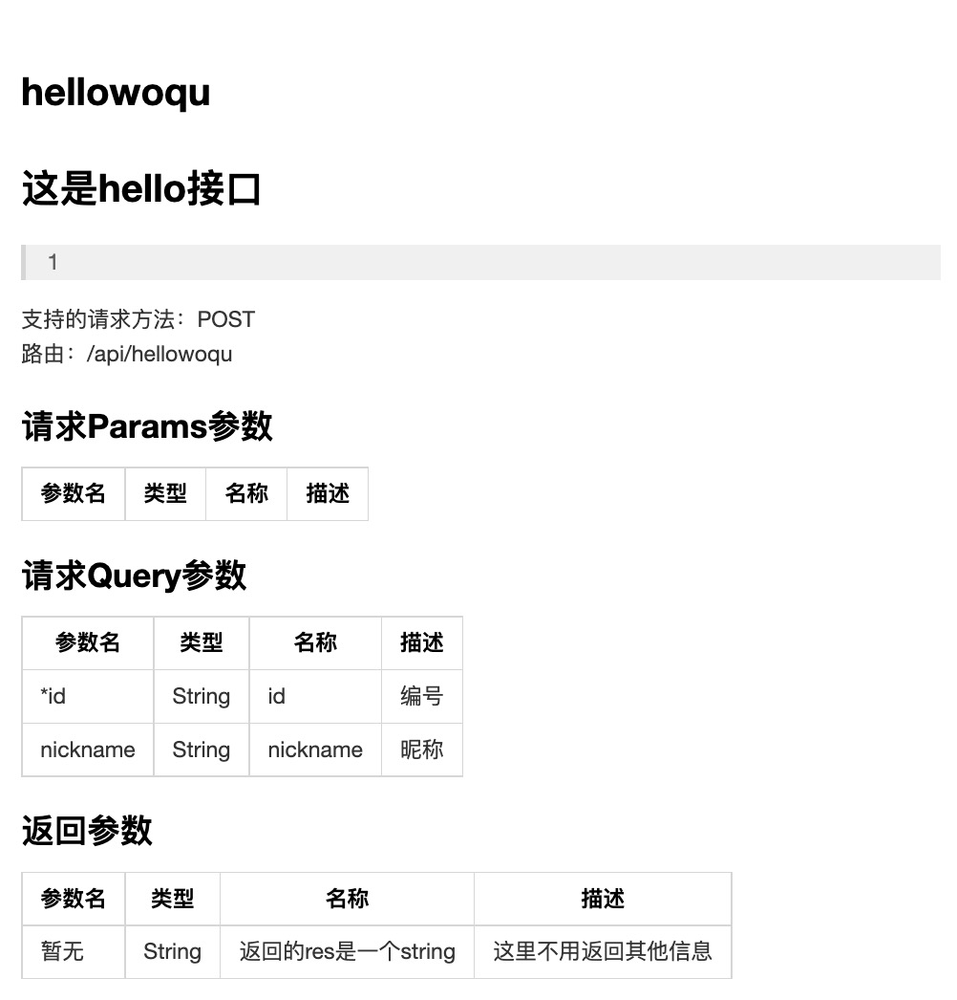
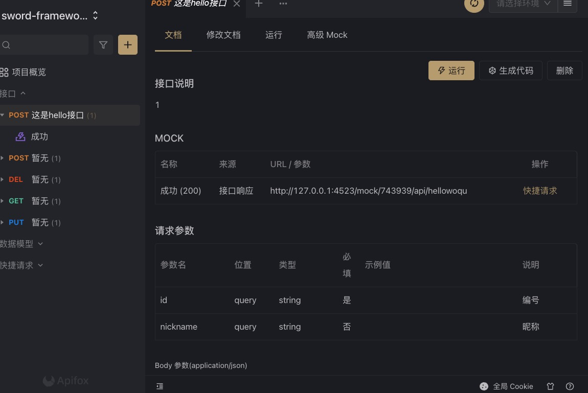

sword-cli版本>1.0.0才可以使用生成文档的功能

我们在proto中可以去写这样的多行注释：

```typescript
/**
* 这是hello接口
* 1
*/

export interface ReqParams {
  
}

export interface ReqQuery {
  /**
  * id
  * 编号
  */
  id: string,
  /**
  * nickname
  * 昵称
  */
  nickname?: string,
}

/**
* 返回的res是一个string
* 这里不用返回其他信息
*/
export type Res = string;

```

多行注释的第一行代表了标题，第二行+第n行代表了介绍
要对接口设置标题和介绍就要在ReqParams上面声明顶级多行注释，同理，如果你返回的类型是一个type（类型别名），那么你也可以使用顶级注释来描述字段。目前仅支持生成以下2种格式：

- \[x] markdown（推荐）
- \[x] openapi（可以导入到apifox，postman中）

<a name="q8q7d"></a>

## 使用

当你安装了@swordjs/sword-framework-cli 到全局/项目中时，你可以直接运行此命令，文档将会生成在docs文件夹下

```typescript
npx sword doc
```

<a name="yiKVy"></a>

## markdown预览



<a name="ShJ30"></a>

## openapi格式（导入到apifox中）



<a name="Ka12x"></a>

## 注意事项

1. 目前使用openapi文档时，需要注意，注释中的第一行（标题）将不会在openapi展现，后续考虑会和第二行（介绍）拼接在说明中一起展示
2. 如何自定义markdown格式？展示不支持，如果你有需要的话，欢迎提issue

<a name="ZuE6n"></a>

## 视频教程

[点击查看【bilibili】](https://player.bilibili.com/player.html?bvid=BV1Gu411y7Sc)
