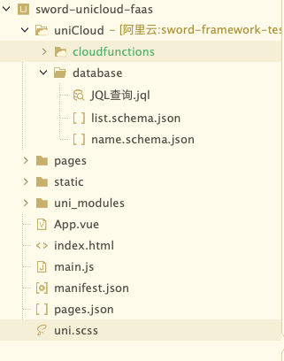
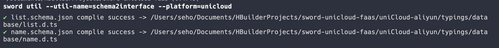
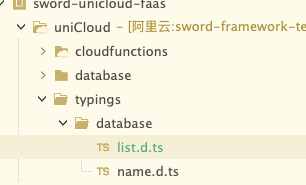

在sword中, 我们贴心给大家准备了一系列的工具, 帮助大家辅助开发, 我们把这些工具都封装到了util命令中, 我们只需要在命令中指定[util-name](../配置/命令行配置.md)和util所要求的[platform](../配置/命令行配置.md)就可以使用了. <a name="nwG2Q"></a>

## schema2interface

- \[运行时环境] unicloud
- 在特定环境下, 我们可以将数据库的schema文件转换为interface文件, 为ts提供支持, 我们只需要在需要的unicloud文件夹下执行如下命令即可

```bash
sword util --util-name=schema2interface --platform=unicloud
```


我们需要找到你的uniapp (unicloud) 项目的根目录, 在终端执行命令; 此时我们的schema2interface工具会自动查找unicloud文件夹下的database, 读取schema.json, 并且把json转换为ts类型协议, 例如这样

```bash
{
	"bsonType": "object",
	"required": [],
	"permission": {
		"read": false,
		"create": false,
		"update": false,
		"delete": false
	},
	"properties": {
		"_id": {
			"description": "ID，系统自动生成"
		},
		"name": {
			"description": "名字"
		}
	}
}
```

转换后的协议为

```typescript
/* tslint:disable */
export interface List {
  /* ID，系统自动生成 */
  _id: string;
  /* 名字 */
  name: string;
}
  
```

工具会把转换后的类型协议放到unicloud下的typings目录中, 你可以自己复制到你所需要的地方, 甚至是我们的sword工程中



> ps: 其实完全可以提供一个配置参数, 让用户指定类型文件的输出目录, 但是由于这个配置很难去设计, 因为这个属于util下的一个工具的属性值, 不是那么好在cli中定义, 所以暂时的方案就是输出到指定的位置. 如果你有更好的方案欢迎提出你的issue

<a name="cgiRL"></a>

## clearShim

- 清空shim文件夹, 在某些版本更新时, cli编译器会对shim程序作出调整, 此时你可以运行这个命令清空项目的shim文件夹, 然后在运行cli命令, 这样cli命令将会生成最新的代码, 你就可以使用新的sword特性啦

```shell
sword util --util-name=clearShim
```

<a name="ufFpc"></a>

## presetApi

- 生成api套装(index.ts + proto.ts)

```shell
sword util --util-name=presetApi --presetApi-name=hello
```
