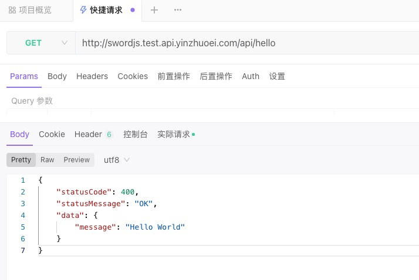

sfu (sword for unicloud) 在之前的版本中是不支持云函数url化的, 但是在v1.2.2的版本之后我们支持了!
[Release v1.2.2 · swordjs/sword-framework](https://github.com/swordjs/sword-framework/releases/tag/v1.2.2) <a name="ocoqL"></a>

## 前置阅读

[返回集成响应](../快速开始/返回集成响应.md) <a name="wYXDL"></a>

## 配置云函数公网地址

[操作场景 | uni-app官网](https://uniapp.dcloud.io/uniCloud/http.html#%E6%93%8D%E4%BD%9C%E6%AD%A5%E9%AA%A4)
我们可以配置一个自定义的触发地址, 然后使用v1.2.2+的版本去运行和编译程序, 你就可以把unicloud程序发布到公网了:



我们可以访问一下, sword的demo api, 这个api就是由sfu构建的

```powershell
curl http://swordjs.test.api.yinzhuoei.com/api/hello
```

它返回了这样的json:

```json
{"statusCode":400,"statusMessage":"OK","data":{"message":"Hello World"}}%                                  
```
