我们在上一部分讲述了sword是如何托管我们的unicloud的应用, 想必大家也已经学会了使用sfu去开发unicloud啦, 那么这一章就让我这个unicloud小白, 和大家一起开发一个简单的功能吧~ <a name="uNl6B"></a>

## 初始化一个项目

如果你全局安装了我们的脚手架之后, 在你熟悉的文件夹下, 跑一下我们熟悉的init命令, 它会帮助我们生成一个模板

```typescript
sword init
```

我们可以看到, 默认的模板中有一个hello world的例子, 它的目录结构是这样的:
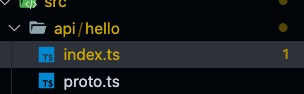 <a name="ug57W"></a>

## 配置unicloud的link属性

我们可以运行程序, 但是在运行程序之前, 我们需要在sword.config.ts的配置项中, 配置unicloud的link属性, 指定我们的云函数目录, 帮助程序把产物编译到指定目录
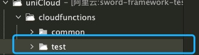
那么如何能获取一个文件夹的完整路径呢? 在windows中, 我们可以这样做:
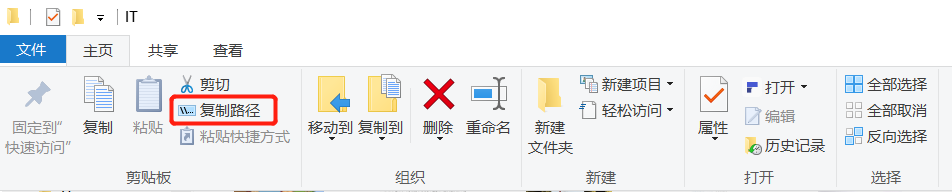
而在macos中, 最简单的办法就是打开我们电脑的任意一个终端, 把云函数的文件夹拖进去, 就可以获取到完整路径了
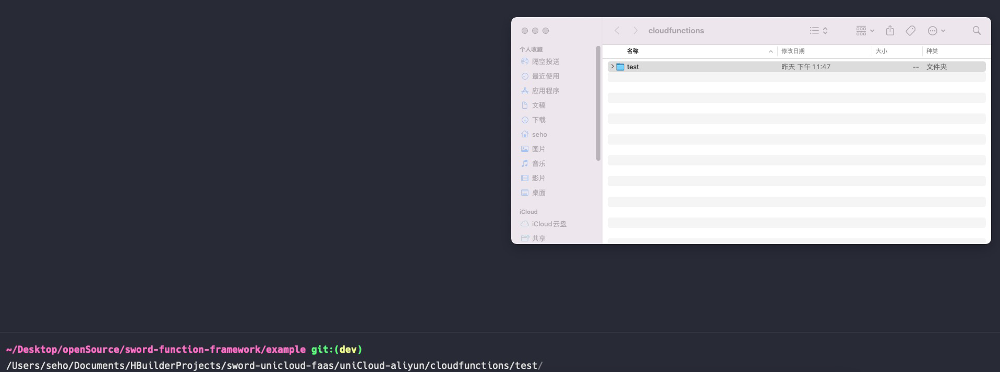
在我们的配置文件中, 把link配置一下就可以啦!

```typescript
import type { Config } from '@swordjs/sword-framework-cli';

const config: Config = {
  unicloud: {
    link: '/Users/seho/Documents/HBuilderProjects/sword-unicloud-faas/uniCloud-aliyun/cloudfunctions/test'
  }
};

export default config;
```

然后你就可以运行我们的unicloud项目了

```bash
npm run dev:unicloud
```

<a name="Y5JtD"></a>

## 创建业务文件夹

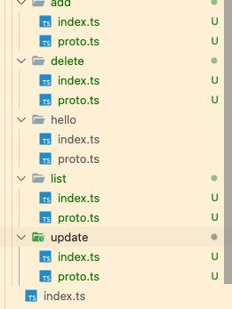
我们可以使用便捷操作符来快捷创建api, 这个概念在[实现API](../快速开始/实现API.md)就已经说明了, 如图我们创建了4个api, 分别是增删改查 <a name="nFM5z"></a>

## 创建表

我们创建一个表schema.json

```typescript
// 文档教程: https://uniapp.dcloud.net.cn/uniCloud/schema
{
	"bsonType": "object",
	"required": [],
	"permission": {
		"read": false,
		"create": false,
		"update": false,
		"delete": false
	},
	"properties": {
		"_id": {
			"description": "ID，系统自动生成"
		},
		"name": {
			"description": "名字"
		}
	}
}
```

并且上传, 我们接下来的demo, 将会用到这个list这个表
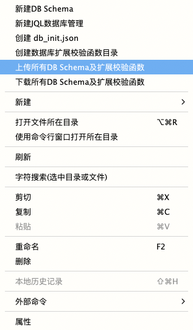

<a name="JyTFn"></a>

## 编写add函数

已知我们的表是需要name字段的, 所以我们的params需要指定name为字符串类型

```typescript
export interface ReqParams {
  name: string;
}
export interface ReqQuery {}
export interface Res {
  success: boolean;
}

```

我们简单实现一下add逻辑, 这并没有做容错处理, 我们在实际开发中, 是需要考虑边界条件的, 但是由于sword, 我们不需要考虑参数带来的边界问题, 因为你获取参数始终是安全的

```typescript
import { useApi, Post } from '@swordjs/sword-framework';
import { ReqQuery, ReqParams, Res } from './proto';

export const main = useApi<{
  query: ReqQuery;
  params: ReqParams;
  res: Promise<Res>;
}>({
  instruct: [Post()],
  handler: async (ctx) => {
    const db = uniCloud.database();
    const collection = db.collection('list');
    const result = await collection.add({
      name: ctx.params.name
    });
    return {
      success: true
    };
  }
});

```

接着我们测试一下, 在云函数的测试json中, 编写下面的对象, 然后本地运行云函数

```bash
{
	"route": "/api/add",
	"method": "POST",
	"query": {
		
	},
	"params": {
		"name": "seho"
	}
}
```

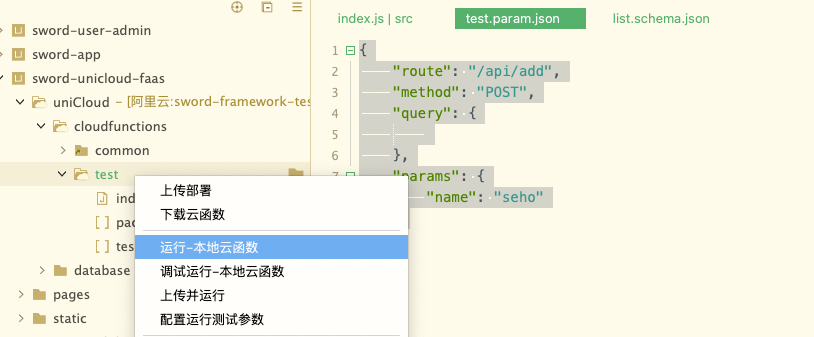
之后, 我们可以在控制台看到, 这个函数已经被成功执行了, 并且我们的数据库已经插入了一条记录
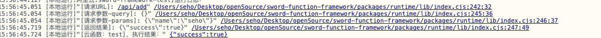 <a name="SmCRi"></a>

## 编写delete函数

我们需要传递一个id, 然后通过id删除一条记录, 所以我们的proto的params是id, 同样也是字符串类型

```typescript
export interface ReqParams {
  id: string;
}
export interface ReqQuery {}
export interface Res {
  success: boolean;
}

```

```typescript
import { useApi, Delete } from '@swordjs/sword-framework';
import { ReqQuery, ReqParams, Res } from './proto';

export const main = useApi<{
  query: ReqQuery;
  params: ReqParams;
  res: Promise<Res>;
}>({
  instruct: [Delete()],
  handler: async (ctx) => {
    const db = uniCloud.database();
    const collection = db.collection('list');
    await collection.doc(ctx.params.id).remove();
    return {
      success: true
    };
  }
});

```

本地运行函数也成功删除了我们的一条记录

```typescript
{
	"route": "/api/delete",
	"method": "DELETE",
	"query": {
		
	},
	"params": {
		"id": "629f046a257bc80001c6c3e0"
	}
}
```

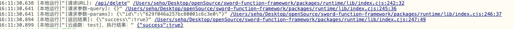 <a name="tqcLU"></a>

## 编写update函数

我们不仅需要传递id, 还需要传递修改后的name, 所以我们的proto需要这么设计

```typescript
export interface ReqParams {
  name: string;
  id: string;
}
export interface ReqQuery {}
export interface Res {
  success: boolean;
}

```

```typescript
import { useApi, Put } from '@swordjs/sword-framework';
import { ReqQuery, ReqParams, Res } from './proto';

export const main = useApi<{
  query: ReqQuery;
  params: ReqParams;
  res: Promise<Res>;
}>({
  instruct: [Put()],
  handler: async (ctx) => {
    const db = uniCloud.database();
    const collection = db.collection('list');
    await collection.doc(ctx.params.id).update({
      name: ctx.params.name
    });
    return {
      success: true
    };
  }
});

```

运行本地云函数

```typescript
{
	"route": "/api/update",
	"method": "PUT",
	"query": {
		
	},
	"params": {
		"id": "629f04bfc2cedc0001308c1b",
		"name": "吴彦祖"
	}
}
```

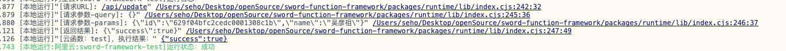 <a name="qcNQF"></a>

## 编写list函数

在list函数中我们要实现返回一个列表, 我们需要前端传递limit, 然后这个函数不再发挥boolean, 而是一个对象数组

```typescript
export interface ReqParams {}
export interface ReqQuery {
  limit: number;
}
export type Res = {
  // unicloud数据库返回的id是有下划线的
  _id: string;
  name: string;
}[];

```

```typescript
import { useApi } from '@swordjs/sword-framework';
import { ReqQuery, ReqParams, Res } from './proto';

export const main = useApi<{
  query: ReqQuery;
  params: ReqParams;
  res: Promise<Res>;
}>({
  handler: async (ctx) => {
    const db = uniCloud.database();
    const collection = db.collection('list');
    const result = await collection.limit(ctx.query.limit).get();
    return result.data as Res;
  }
});

```

由于unicloud的type是官方工具生成的, 所有很多api都没有泛型支持, 我们这里直接as成Res保证程序不报错就可以了

```typescript
{
	"route": "/api/list",
	"method": "GET",
	"query": {
		"limit": 1
	},
	"params": {

	}
}

```

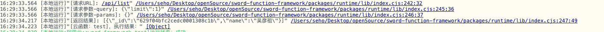 <a name="jnANo"></a>

## 部署上线

```bash
npm run build:unicloud
```

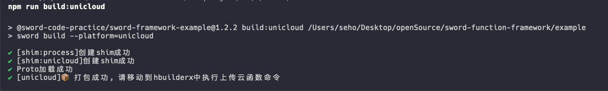
这个时候, 你会发现我们的代码已经被编译好了, 放到了云函数的根目录中
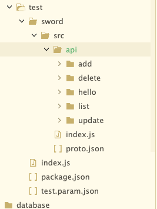
接下来, 我们就尝试一下, 上传并且运行, 它会在云端执行我们的函数
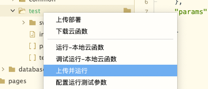
可以看见, 我们的云函数已经成功运行啦😄
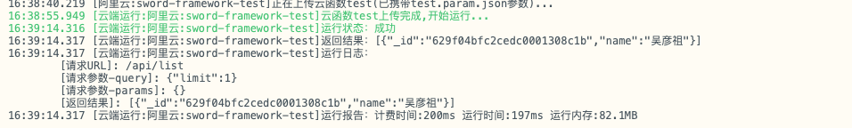
