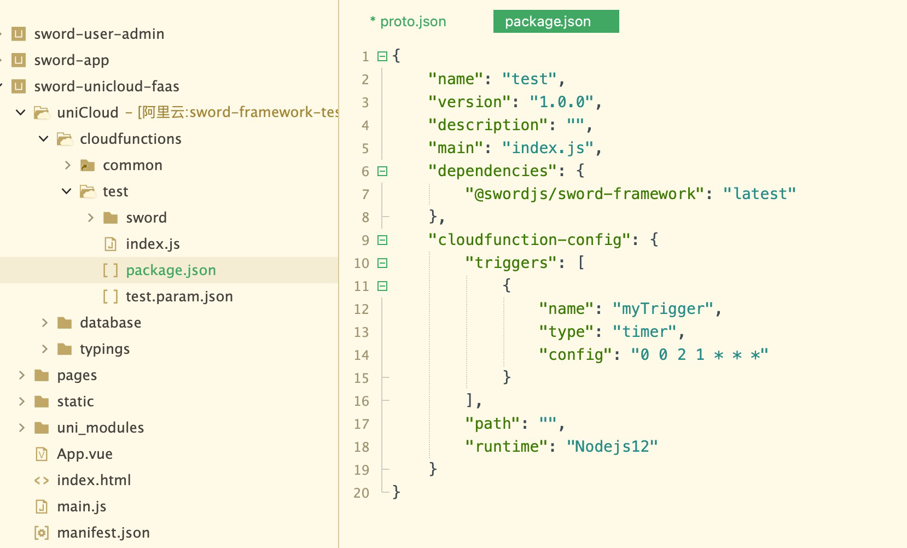

<a name="wm1C7"></a>

## 默认支持最低的node版本是12

云函数的配置必须是nodejs12, 因为框架编译的产物的默认最低需求就是nodejs12, 否则很多相对新的语法都无法运行, 配置如下 (云函数根目录package.json)

```json
"cloudfunction-config": {
  "triggers": [
    {
      "name": "myTrigger",
      "type": "timer",
      "config": "0 0 2 1 * * *"
    }
  ],
  "path": "",
  "runtime": "Nodejs12"
}
```


