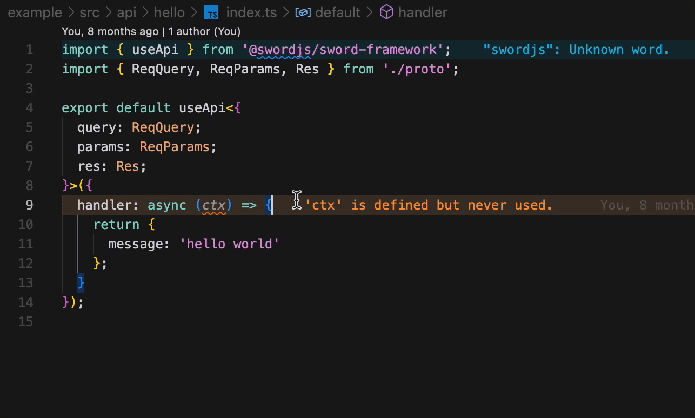

由于sword.js是跨厂商/平台的, 所以我们很多时候都需要对不同平台做不同的业务逻辑, 也就是条件编译功能 <a name="xxaQv"></a>

### 编译宏

```typescript
// @ifdef server || unicloud
console.log("server or unicloud")
// @endif
```

我们可以在注释中使用**@ifdef**编译宏, 以此来告诉编译器其中的代码仅运行在指定平台中; 如果想让代码仅运行在单个平台, 那么就这样编写

```typescript
// @ifdef server
console.log("server")
// @endif
```

同理, 我们也可以写**@ifndef**代表排除功能, 指的就是此处的逻辑不在给定的平台中运行

```typescript
// @ifndef server
console.log("other")
// @endif
```

我们如果使用编译宏的方式去写条件编译, 是完全可以替代**usePlatform**这个hook函数的, 这就意味着我们没有任何运行时开销.&#x20;
在vscode插件中, 也支持很好的编译宏条件编译的代码片段提示:
 <a name="f7xPx"></a>

### Process.env.\_SWORD\_PLATFORM

同样的, 使用process.env中做判断也是可行的, 因为在sword.js中暴露了一些可访问的内部属性; 并且在最新的初始化工程中已经集成了一段类型提示; 这样开发者在调用env属性时, 就有类型声明啦!

```typescript
if(process.env._SWORD_PLATFORM === "server"){
 // do something...
}
```

值得注意的是, 这段代码在打包之后也没有任何运行时, 最终表现是和编译宏一样的, 所以开发者可以尽情选择自己喜欢的方式编写条件编译代码
:::success
在sword.js中, 可供访问的内部属性均优化了打包流程, 输出的代码确保是干净的, 将尽可能的减少运行时开销
:::
