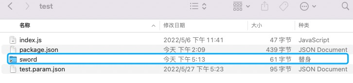

在本篇unicloud开发教程中, 我们不会过多的介绍如何去开发api, 因为这已经在sword基础教程中都提到过, 在本篇入门文章中, 我们可以理解sfu的原理, 从而让我们窥探sword本质, 让我们开发unicloud如鱼得水 !
首先, unicloud是serverless环境, 整个函数的运行状态是stateless的, 我们不可以像server一样, 去在内存中持久化一个数据, 在unicloud (serverless) 环境中, sfu做的仅仅是触发api就可以了, 然后为了提升开发体验我们脱离了hbuilderx, 我们可以使用自己熟悉的编辑器搭配sword编译器, 可以把代码通过[软链接](https://xzchsia.github.io/2020/03/05/linux-hard-soft-link/)到hbuilderx中的cloudfuntion中, 这样即可以在hbuilderx中调试, 又可以使用sword的语法开发程序, 这一模式借鉴了tsrpc框架的前后端共享代码的想法. <a name="fMMke"></a>

## 指定目标云函数目录

我们可以在工程下新建 [sword.config.ts 配置文件](../配置.md), 用来配置unicloud环境下的link属性

```typescript
import type { Config } from "@swordjs/sword-framework-cli"

const config: Config = {
  unicloud: {
    link: "/Users/seho/Documents/HBuilderProjects/sword-unicloud-faas/uniCloud-aliyun/cloudfunctions/test"
  }
}

export default config;

```

link指定的则是我们开发环境中, hbuilderx中的云函数路径 (此处是macos的路径) <a name="YdWpu"></a>

## 启动开发服务器

```bash
npm run dev:unicloud
```

启动之后你会发现终端有这样几个日志:

```bash
✔ [shim:process]创建shim成功                                                                                                                                                          
ℹ 正在监听工程中的src/api文件夹...                                                                                                                                                    
✔ Proto加载成功                                                                                                                                                                       
✔ [shim:unicloud]创建shim成功                                                                                                                                                        
✔ [unicloud:link]🔗软链接成功                                                                                                                                                       
ℹ [unicloud:link]在hbuilderx中，无法在项目管理中显示通过软链接创建的文件夹，你可以打开文件目录查看详情                                                                                 
✔ [unicloud:dev]📦 编译成功 
```

当我们首次通过dev开启一个服务器的时候, 脚手架会自动地将我们编译过后的产物软链接到hbuilderx中了


> ps:  在hbuilderx中的项目管理器中不会显示\[软链接], 在系统的文件管理中可以看到我们的“替身”

<a name="PACEt"></a>

## 让sfu接管你的unicloud程序

我们需要在hbuilderx中云函数的根目录index.js中, 将原有的代码替换为:

```javascript
exports.main = require("./sword/src/index.js");
```

此时此刻, 请不要着急本地运行这个云函数, 因为你本地运行会遇到这个错误:

```bash
[本地运行:阿里云:sword-framework-test]本地运行云函数【test】(已携带test.param.json参数)...
[本地运行:阿里云:sword-framework-test]运行日志：
[本地运行]"[云函数：test]，执行结果：" {"statusCode":400,"statusMessage":"event is not valid (unicloud)"} 
[本地运行:阿里云:sword-framework-test]运行状态：成功
```

当前运行云函数, 没有任何的参数, sfu并不知道, 你想要调用哪个api, 传递哪些参数, 这个event的类型是这样的:

```javascript
export type HttpInstructMethod = 'GET' | 'HEAD' | 'POST' | 'PUT' | 'DELETE' | 'CONNECT' | 'OPTIONS' | 'TRACE';

export type UnicloudEvent = {
  route: string;
  method: HttpInstructMethod;
  query: Record<string, unknown>;
  params: Record<string, unknown>;
};
```

所以我们需要携带这样的对象给云函数, 然后再本地运行:

```json
{
	"route": "/api/hello?id=1&nickname=1",
	"method": "POST",
	"query": {},
	"params": {}
}
```

此时此刻你就已经完成了你的第一个unicloud云函数:

```bash
[本地运行:阿里云:sword-framework-test]本地运行云函数【test】(已携带test.param.json参数)...
[本地运行:阿里云:sword-framework-test]运行日志：
[本地运行]"[请求URL]: /api/hellowoqu" 
[本地运行]"[请求参数-query]: {\"id\":\"1\",\"nickname\":\"1\"}"
[本地运行]"[请求参数-params]: {}" 
[本地运行]"[返回结果]: {\"message\":\"hello\"}" 
[本地运行]"[云函数：test]，执行结果：" {"message":"hello"} 
[本地运行:阿里云:sword-framework-test]运行状态：成功
```

我们熟悉的日志又回来了, 这和server端的日志是一样的, 这就证明了, sfu已经成功地接管了你的unicloud应用了 ! <a name="vBMoS"></a>

## 编译生产版本

sfu和sword的生产编译同出一辙, 都是使用esbuild构建, 而且在编译器中完成了对unicloud的适配

```bash
npm run build:unicloud
```

```bash
✔ [shim:process]创建shim成功                                                                                                                                                           17:41:49
✔ [shim:unicloud]创建shim成功                                                                                                                                                          17:41:49
✔ Proto加载成功                                                                                                                                                                        17:41:49
✔ [unicloud]📦 打包成功, 请移动到hbuilderx中执行上传云函数命令
```

细心的你可能发现了, 我们的云函数目录, 从之前的软链接变成了独立的文件夹, 是因为我们此时的宿主环境不再是本地系统了, 而是unicloud云端, 所以我们就把产物复制了一份放到了云函数目录里, 此时此刻, 你现在可以上传你的云函数到云端啦 !
