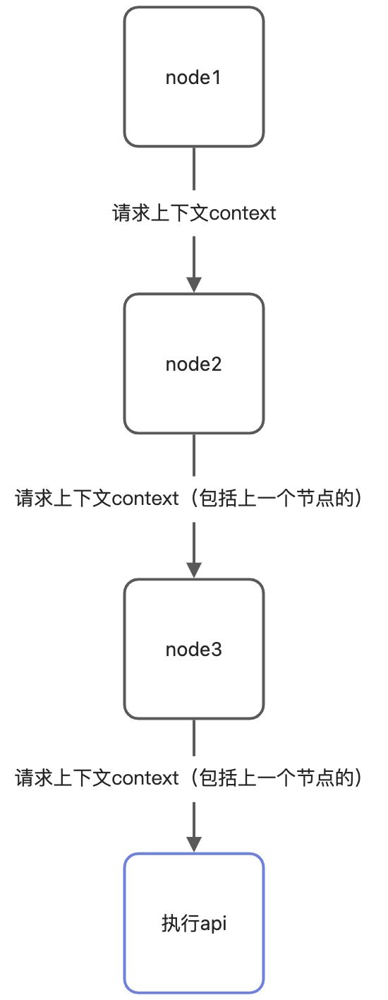

目前sword.js 只提供了如下几个pipeline节点

- \[x] preApiCall （在api调用之前）
- \[x] postApiCall（在api调用之后）

使用pipeline非常的简单，我们只需要掌握几个基本概念就可以了，下面是一个pipeline系统的运转流程：



我们假设这个流程是preApiCall，在这个流程中，所有node节点都在api执行前，也印证了preApiCall的触发时机（api触发前），在api触发前我们可以注册多个node（并且执行node里面的逻辑），**每一个node都会有一个上下文，下一个node的上下文会是上一个node的返回值**。
可以试想一下，业务有一个场景是这样：我们需要判断用户是否传递了登录状态，如果登录了就执行api，没登录就直接返回一个对象给客户端，那么此时就会涉及到一个概念叫做**中断node（或者称之为中断节点）**

<a name="jThPn"></a>

## 中断节点

中断节点指的就是，在pipeline中，如果用户显式地返回了一个context return，或者返回了null和undefined，sword.js将不会执行剩下所有的同类型节点（node2, node3都不会执行了），而且如果你显式的返回了context return，那么就连api逻辑都不会执行了。

```json

import { useApp, usePipeline } from '@swordjs/sword-framework';

const pipeline = usePipeline();

const app = useApp();

// node1
pipeline('preApiCall', (ctx) => {
  ctx.return = {
    data: {
      success: true
    }
  }
  return ctx;
})

// node2
pipeline('preApiCall', (ctx) => {
  return null;
})

// node3
pipeline('preApiCall', (ctx) => {
  return null;
})

const init = () => {
  // init
};

init();
```

在这个demo里我们的3个node都是中断节点，你可能会问，明明node1返回了ctx，为啥还算是中断，是因为它给ctx显式的设置了return对象，如果sword.js观察到ctx存在return，将不会执行api逻辑（包括剩下的其余节点），直接返回。
那么我们修改一下上面的demo：

```json
// node1
pipeline('preApiCall', (ctx) => {
  return null;
})

// node2
pipeline('preApiCall', (ctx) => {
  console.log("不会执行我了")
  return null;
})
```

如果返回null/undefined，那么就不会执行后面所有同类型的pipeline了。

<a name="Lwq82"></a>

## 实现一个登录拦截功能

所以我们可以用pipeline来实现一下我们之前说的，登录拦截功能。

```json
pipeline('preApiCall', (ctx) => {
  if(!ctx['reqHeaders']['auth']){
    ctx.return = {
      data: {
        auth: false,
        message: "暂未登录"
      }
    }
  }
  return ctx;
})
```
