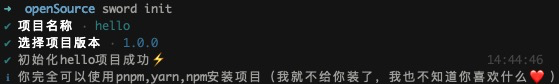

首先非常建议你使用pnpm构建应用程序，而且为了方便开发需要，你需要在全局安装一个cli脚手架，这个脚手架很小，主要是在开发和打包以及初始化工程需要用到它。

[@sword-code-practice/backend-cli](https://www.npmjs.com/package/@sword-code-practice/backend-cli)

推荐Node版本: 16.X

```bash
# 你可以使用pnpm/npm/cnpm
npm i @swordjs/sword-framework-cli -g
```

然后我们就可以在你需要创建工程的目录下，执行下面的代码

```bash
sword init
```

这个时候可以输入你的项目/文件夹名称，选择一个最新版本的模板文件，你的应用就初始化成功啦！

进入项目之后，安装依赖完成之后，你就可以直接把应用跑起来了～

```bash
npm run dev
```

然后当你访问http:localhost:3000/api/hello（如果默认端口没有被占用，就是3000），就会返回下面的json

```bash
{
  "message": "hello"
}
```

<a name="H0IRt"></a>

## 实战视频教程

你可以自己录制使用sword.js的开发过程，欢迎上传到b站，知乎等各大平台，在这里我只列出我自己出的一些视频demo，希望对大家有一定的帮助。
[点击查看【bilibili】](https://player.bilibili.com/player.html?bvid=BV1sS4y1N7HA)
