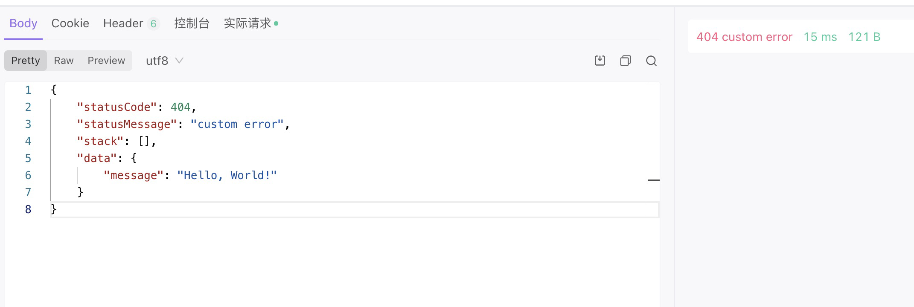

什么是集成响应? 在你的业务中肯定会需要自定义状态码, headers返回头, 在传统的nodejs开发中,比如koa中是这样写的:

```typescript
response.body = {
  ...
}
```

那么同样的, sword集成响应可以轻松的帮你完成这个需求, 所以我们在useApi中新增了一个特性:

```typescript
import { useApi } from '@swordjs/sword-framework';
import { ReqQuery, ReqParams, Res } from './proto';

export default useApi<{
  query: ReqQuery;
  params: ReqParams;
  res: Res;
}>({
  handler: async (ctx) => {
    return () => ({
        statusCode: 200,
        statusMessage: 'success',
        headers: {},
        data: {
          message: 'Hello, World!'
        }
     });
    }
  });
```

runtime会检查你的返回值, 如果是函数, 你在IDE中不仅会获得类型提示, 还会返回集成响应, 意味着你不需要任何学习成本, 只需要更改为函数返回值就可以了😄 !
useApi返回函数的返回值类型如下:

```typescript
export type CustomHandlerReturn<D = any> = () => {
  statusCode?: number;
  statusMessage?: string;
  data?: UnPromisify<D>;
  headers?: Record<string, string>;
};
```

我们可以指定, 状态码等等信息, 都是可选的, 都有一个安全的默认值:

| statusCode | 默认值: 200 |
| --- | --- |
| statusMessage | 默认值: "" |
| data | 默认值: {} |
| headers | 默认值: {} |

<a name="vJTzJ"></a>

## 平台差异

集成响应在不同的平台表现是一样的, 首先集成响应的设计是参照了h3的error设计 (即server端), 它的数据结构是这样的:

```json
{
  statusCode: 404,
  statusMessage: "not found",
  stack: []
}
```

判断当前的statusCode是否是2xx, 如果不是2xx会直接触发服务器错误, 并且你指定的statusMessage和data都会被返回; 反之将会直接返回data中的内容 <a name="cx4Bm"></a>

### server

```json
export default useApi<{
  query: ReqQuery;
  params: ReqParams;
  res: Res;
}>({
  handler: async (ctx) => {
    return () => ({
        statusCode: 404,
        statusMessage: 'custom error',
        headers: {
          foo: '666'
        },
        data: {
          message: 'Hello, World!'
        }
      })
    }
});

```



如果当前是2xx:

```json
{
    "message": "Hello, World!"
}
```

<a name="tdX2w"></a>

### unicloud

unicloud平台分为应用内调用和云函数url化, 应用内调用和server端无异, 但是在云函数url化中, sword做了一些特殊的处理 <a name="Sq194"></a>

#### 云函数url化

框架会返回一个[unicloud的集成响应](https://uniapp.dcloud.io/uniCloud/http.html#%E6%93%8D%E4%BD%9C%E6%AD%A5%E9%AA%A4), 数据结构如下, 你在业务中无需关心:

```json
{
  mpserverlessComposedResponse: true, // 使用阿里云返回集成响应是需要此字段为true
  isBase64Encoded: false, // 硬编码
  statusCode: customResult.statusCode,
  body: result,
  headers: customResult.headers
};
```

<a name="yM1vs"></a>

## 注意事项

- 如果状态码返回204, 如果在http环境, 将不会显示任何data内容, 但是headers是正常的.
